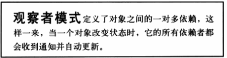
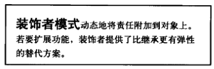

## *设计原则

1、把需要改变的和不需要改变的独立开来，代码不要混在一起。  
2、针对接口编程，而不是针对实现编程。  
3、多有组合，少用继承。  
  
4、为了交互对象之间的松耦合设计而努力。  

5、开闭原则：类应该对扩张开发，对修改关闭。

### 一、策略模式（Strategy）
  

### 二、观察者模式（Observer）   
   
 
### 三、装饰者模式（Decorator）   
 

