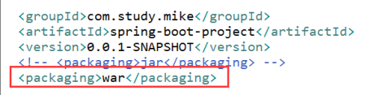
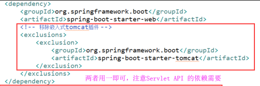
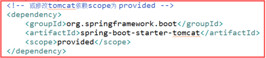
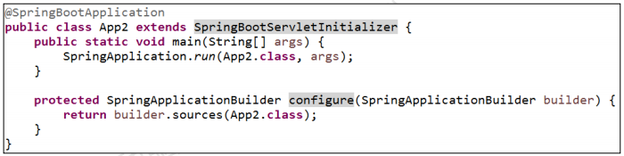
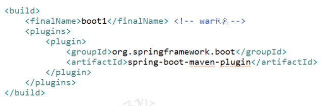
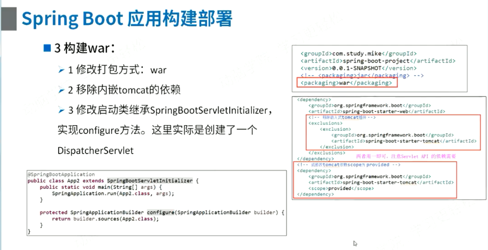
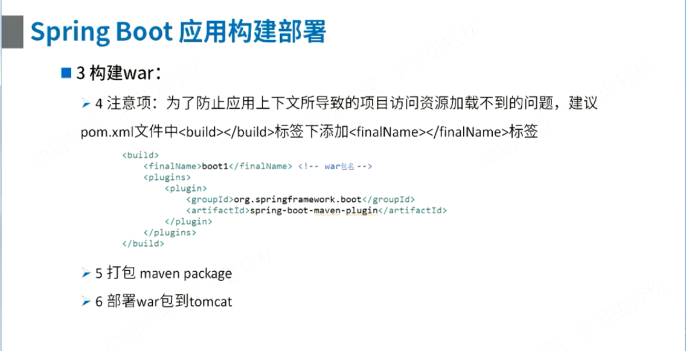

方法如下：
- #### 1、修改pom文件中打包方式为 war 
  

- #### 2、移除内嵌的tomcat依赖。
   有两种方法。如下：
   第一种:在starter-web里排除tomcat。用这种方法需要增加servlet-api.jar的引用。
     
   
   第二种：增加tomcat依赖并将scope设置为provided。推荐使用第二种。
   
     

- #### 3、修改启动类，继承SpringBootServletInitializer，实现configure方法。实际上是创建了一个DispatcherServlet。
     

- #### 4、为了防止应用因上下文导致的项目访问资源加载不到的问题，建议在pom.xml文件中`<build/>``</build>`标签中添加`<finalName>``</finalName>`标签。
     

- #### 5、打包（执行maven package）

- #### 6、将war包部署到toncat、weblogic等容器中。

  
  

