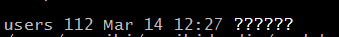
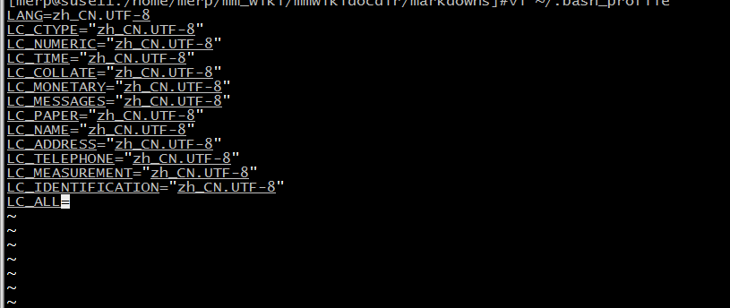

**今天在用SecureCRT登录服务器的时候发现，ls命令查看文件列表。中文文件名显示为问号，如下图：**
  

网上查了查应该修改一下lang这个变量。步骤如下：

- 1、先用locale命令查看，发现配置的字符集不对
- 2、修改用户变量：vi ~/.bash_profile 填下如下内容：

```
LANG=zh_CN.UTF-8
LC_CTYPE="zh_CN.UTF-8"
LC_NUMERIC="zh_CN.UTF-8"
LC_TIME="zh_CN.UTF-8"
LC_COLLATE="zh_CN.UTF-8"
LC_MONETARY="zh_CN.UTF-8"
LC_MESSAGES="zh_CN.UTF-8"
LC_PAPER="zh_CN.UTF-8"
LC_NAME="zh_CN.UTF-8"
LC_ADDRESS="zh_CN.UTF-8"
LC_TELEPHONE="zh_CN.UTF-8"
LC_MEASUREMENT="zh_CN.UTF-8"
LC_IDENTIFICATION="zh_CN.UTF-8"
LC_ALL=
```




- 3、断开SecureCRT，重新登录。用locale命令查看，发现配置已经生效。使用ls命令，文件名称已经正常显示。
